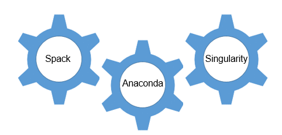
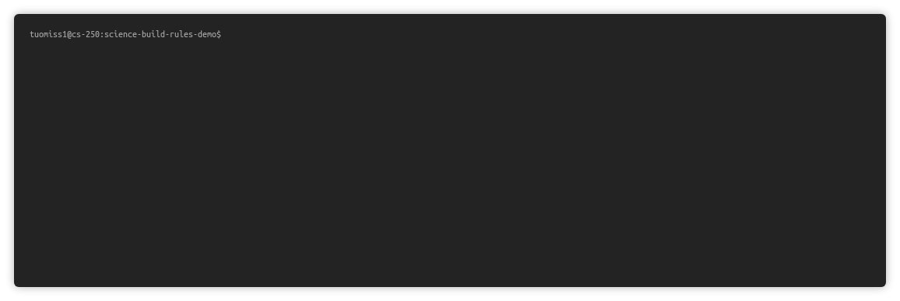

# science-build-rules



In data analytics and high performance computing users often need very recent software that OS repositories do not provide or those are too old. Furhermore in 
multiuser system several versions of the same software are sometimes needed. science-build-rules is a python framework to fulfill these needs and to automate 
this deployment process in Linux systems. Different sofware version are automatically made available via [modules system](https://lmod.readthedocs.io).

science-build-rules can be used for standalone, but for full CI/CD we have written git-based pipeline 
[science-build-environment](https://github.com/AaltoScienceIT/science-build-environment) that uses science-build-rules as an engine.

This science-build-rules framwork has a `buildrules`-package that constains Builders for:

1. [Spack](https://spack.io)
2. [Singularity](https://sylabs.io/singularity) (work-in-progress)
3. [Anaconda](https://anaconda.org) (work-in-progress)

After the software is build successfully it is deployed using a Deployer. Currently there's only one Deployer: `RsyncDeployer`.

## Quick installation

Installation can be done by running the following commands

### 1. Install the python package 



```sh
git clone --recurse-submodules https://github.com/AaltoScienceIT/science-build-rules.git
cd science-build-rules
./install.sh
```

This does the following things:

   1. Clones both the science-build-rules repo and the latest spack upstream repo.
   2. Installs miniconda to science-build-rules/conda
   3. Installs an environment called `buildrules` to the conda environment.

### 1.b (optional) Use your own python env

If you have your own `anaconda` setup you can run
```sh
conda env create -f environment.yaml
```
to create the environment.


### 2. Activating the environment:
```
export PATH=$(pwd)/conda/bin:$PATH
source activate buildrules
source spack/share/spack/setup-env.sh
```

### 2.b (optional) setup singularity

If you plan to build singularity images, make sure your user has right to singularity build.

### 3. All set, you are ready to build software


## Creating documentation

All of the documentation is done by `sphinx`. 

After installation:

```sh
cd docs
make html
```

Documentation can be found in `docs/_build/html/index.html`

## Running test build

After installation, you can find out what a test build does with:

```sh
python -m buildrules spack describe configs/example/spack
```

To do the build, you can run:

```sh
python -m buildrules spack build configs/example/spack
```
