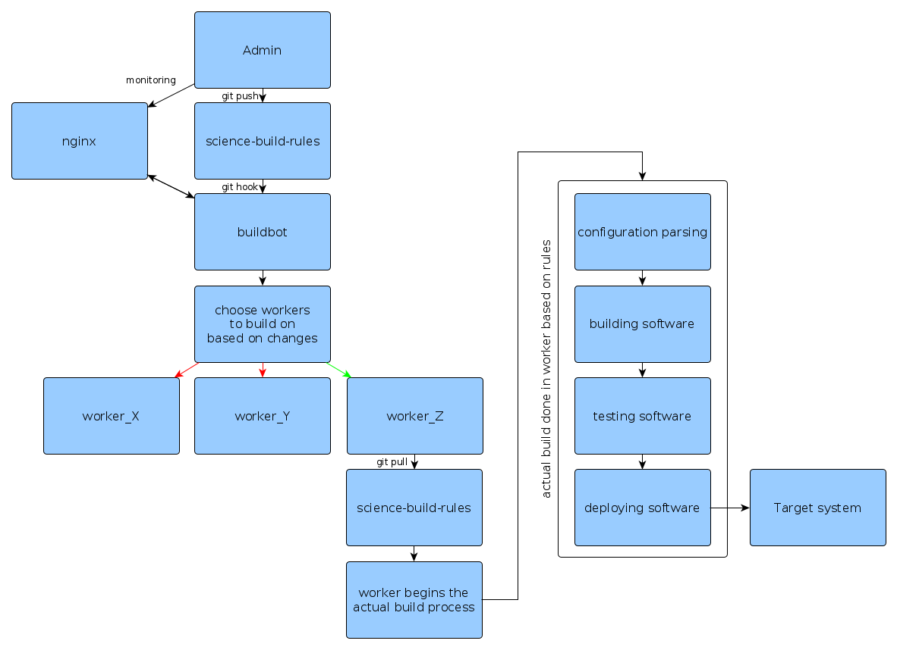

# science-build-environment


science-build-environment is a simple containerized CI/CD solution for 
building and deploying software using 
[science-build-rules](https://github.com/AaltoScienceIT/science-build-rules) framework. 
Main component of this CI/CD is continuous integration framework [buildbot](https://buildbot.net/). 
It is configured to listen git-hooks and upon commit launches proper software build 
container(s) that does the actual compilation.

science-build-rules currently support software build and deployment of scientific software with:

1. [Spack](https://spack.io)
2. [Singularity](https://sylabs.io/singularity) (work-in-progress)
3. [Anaconda](https://anaconda.org) (work-in-progress)

# Build structure



## Requirements

science-build-environment requires `docker` and `docker-compose`.

## Quick installation

science-build-environment is configured with science-build-rules' `ci`-builder.
To install science-build-rules, one can do the following:

```sh
git clone git@github.com:AaltoScienceIT/science-build-rules.git science-build-rules
cd science-build-rules
./install.sh
export PATH=$(pwd)/conda/bin:$PATH && source activate buildrules
```

After this, one can run the following commands to install
science-build-environment into `/tmp/science-build-environment`:

```sh
cp -r configs/example/ci configs/ci
sed -i 's/builder uid here/'$(id -u)'/g' configs/ci/build_config.yaml
python -m buildrules ci build configs/ci
```

To run the CI environment, one can run the following commands:
```sh
cd /tmp/science-build-environment
sudo modprobe nfsd
docker-compose up
docker-compose up
```
`sudo modprobe nfsd` is required for the nfs server that shares folders
for workers. `docker compose up` needs to be run twice as there is a race
condition with build server and nfs that is not yet fixed.

After the builder starts, one can login to
[https://localhost](https://localhost). The example server uses self signed
certificates, so one usually needs to allow for the connection. After this
one can launch an example `centos` build by clicking
`Builders` -> `Spack - centos` -> `SpackForce_centos`.
