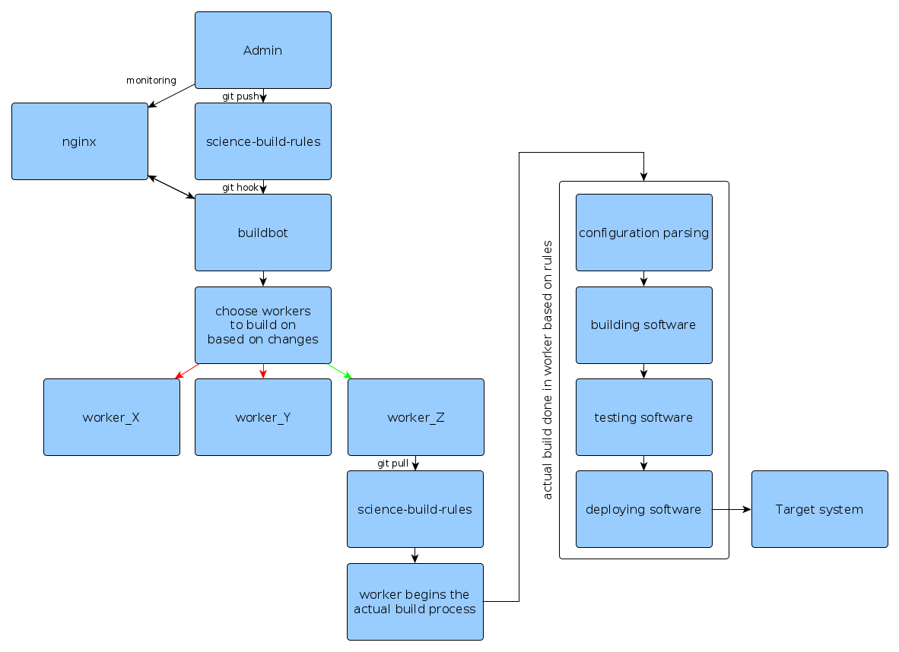

========
Overview
========

Science-build-environment is a continuous integration tool designed to work in tandem with science-build-rules. 

****************
Build timeline
****************

Above is the timeline of what SBE does. When an admin makes a change in the science-build-rules repository, a build is triggered on all the relevant workers. The build configurations themselves are defined in the science-build-rules repository.