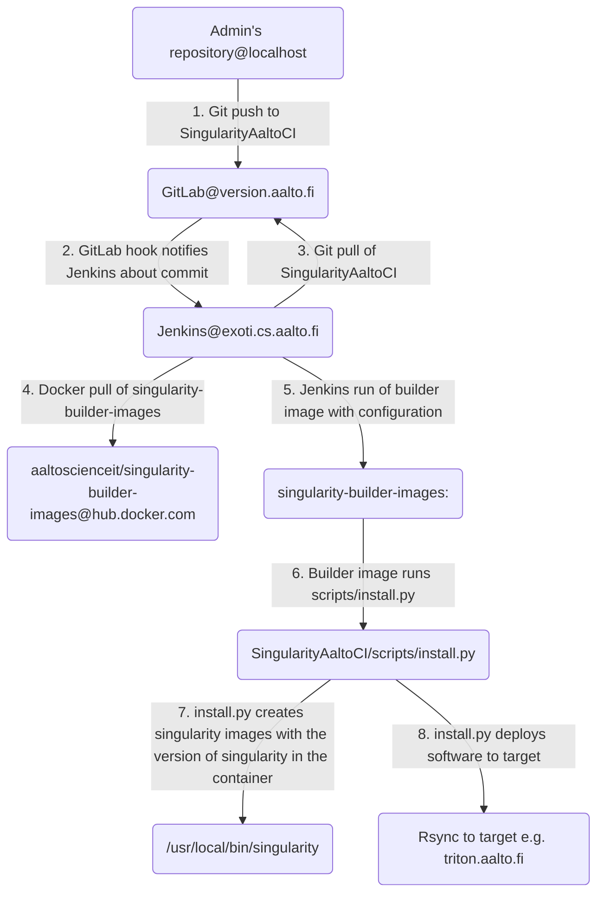

# Singularity Aalto CI

This repository contains rules on what singularity images to build.

## How the build setup is organized

This graph shows how the automated setup builds software:



Scripts that do the installations steps are documented in the
[scripts documentation](scripts/SCRIPTS.md).

### Why so complicated? Can't I just install the software?

This is a straight quote from 
[SpackAaltoCI readme](https://version.aalto.fi/gitlab/AaltoScienceIT/SpackAaltoCI/blob/master/README.md)

> 1. If you install software yourself, it might work only because you have set it
> up. Also other admins cannot edit the software as you are the owner. Thus
> having an independent user (triton-ci, uid 2000407) that is limited rights to 
> doing the installations, these problems are solved.
> 2. Without automatization it is hard to control the environment. Even if admins
> agree to use the same settings, there might be small changes that make
> replicating installations hard.
> 3. The installation should be verified before it is taken into production. If
> installation fails, no software should be installed. Currently the setup only
> check if installation was successful, but in future there should be some unit
> tests.
> 4. With this setup every software installation is versioned, as information on
> installation is stored in the git repositories. If some there is a regression 
> we can just re-install whatever part of the software tree want.
> 5. The current setup allows building of software for multiple targets.
> Currently there's only two: centos (read: triton) and ubuntu (read: 
> Aalto-ubuntu), but there's possibility of building specialized modules for
> more exotic configurations. All software is build in an docker image that has
> the same operating system as the target operating system.
> 6. The admin does not need to run scripts. By simply adding some instructions
> to configuration files the build setup should do everything. If something
> fails, admin can look at the build log or login to exoti.cs.aalto.fi as 
> triton-ci and go to the docker environment. After error has been resolved
> a new commit can be done the fix the build.

## Usage

### On updating documentation

If you just want to update documentation and do not want to trigger a build, 
you can specify `[ci-skip]` in your commit message and Jenkins will ignore
the commit.

### Adding packages

To add an image one needs to modify `configs/$TARGET/versions.yaml`.
The configuration syntax is documented in 
[configuration documentation](configs/CONFIG.md).

### Deleting previously installed images

Currently there's no good way of automatically uninstalling the packages.
Best way is to log in to `exoti.cs.aalto.fi` as `root` and remove the 
image from 
`/singularity-ci/<target>/images/<image>` and the module from
`/singularity-ci/<target>/modules/<modulename>/<moduleversion>`. In worst case
one can even remove everything from the `image`-folder as SingularityAaltoCI 
will then build all of the images.

### Monitoring build

To monitor the build or see the output you should go to the
[commits page](https://version.aalto.fi/gitlab/AaltoScienceIT/SingularityAaltoCI/commits/master).
If you see a green tick next to your commit the build was successful. To see
output of the build you can click the tick and in the resulting page click
`Stages` -> `jenkins`. This will forward to build's page in `exoti.cs.aalto.fi`.
Now by clicking on `Console output` you will see the whole build output.

### Build failed, what to do

If your build failed, you should check the following:

If something in the compilation failed, but you do not know what, you can ssh to
`exoti.cs.aalto.fi` as `root` and run

```sh
build_shell <target>
```

This will start an interactive session of the build image.
Here you can run

```sh
singularity -d -v build /tmp/test.simg /singularity/definitions/<definition file>
```

This will try to build the image according to the definition file created from
the instructions given in `versions.yaml`. You will find the definition file name
in the console output.

## Adding a new target

To add a new target one needs to create a new docker image to
[singularity-builder-images](https://hub.docker.com/r/aaltoscienceit/singularity-builder-images)
with a tag that matches the target.

After this a new configuration folder in `configs/<target>` with correct
configuration needs to be created. Easiest way of doing this is to simply
copy existing configuration and modify them accordingly.

Thirdly, a new build step needs to be added to jenkins. In
[job configuration](https://exoti.cs.hut.fi/job/SingularityAaltoCI/configure) under
**Build**-header one can use `Add build step`-button to add an
`Execute shell`-step. Copy-pasting existing build step and changing the
TARGET-environment value will be sufficient.

Lastly, one must log in to `exoti.cs.aalto.fi` as `root` and run 
`mkdir -p /singularity-ci/<target>/{definitions,images,modules}`. For rsync
deployment to remote system one might need to copy a deployment key to 
`/singularity-ci/home/.ssh` and add configuration of deployment host to 
`/singularity-ci/home/.ssh/config`.

## Installing SingularityAaltoCI to a new build host

Too long; didn't write. Yet.
