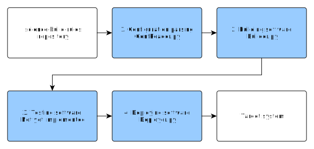

*******************************
Overview of science-build-rules
*******************************

``science-build-rules`` is a suite of Python classes and utilities that
make it easier to create automated builds with Spack, Singularity and
Anaconda. It is designed to run with ``science-build-environment``, but it
can also be run independently. The basic structure is described below:

Typical build will do the following steps:

1. Reading and validating configuration. This is done by the
   ``ConfReader``-class.
2. Building the software based on build rules. This is done by subclasses
   of the ``Builder``-class.
3. Testing the installed software. This step is not yet implemented.
4. Deploying software from the build system into a target system using a
   desired deployment strategy. This is done by subclasses of the
   ``Deployer``-class.

The basic idea of the buildrules is that a series of operations - defined
by a ``Builder``-class - are done in a specific way defined by the configuration
files. Before doing the build, configuration files are loaded in and
validated. The build and deployment commands, which are based on the configuration files, are then predefined and wrapped in subclasses of the ``Rule``-class. Each subclass of ``Builder`` and ``Deployer`` can have their own configuration yaml-files and corresponding schemas.
