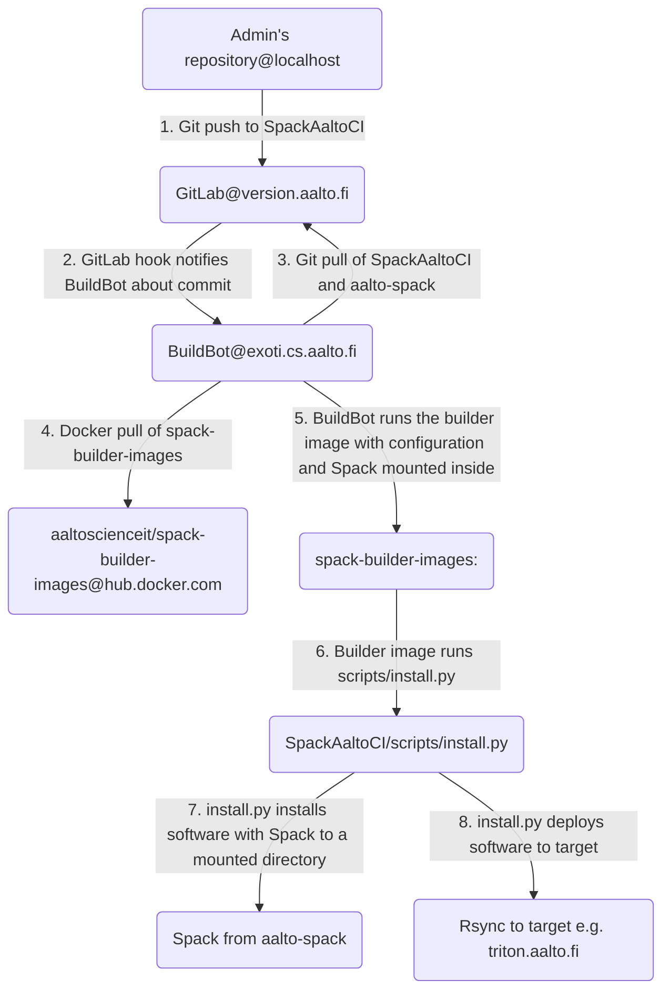

# Spack Aalto CI

This repository contains installation rules and software version information
for automated builds.

## How the build setup is organized

This graph shows how the automated setup builds software:



Scripts that do the installations steps are documented in the
[scripts documentation](scripts/SCRIPTS.md).

### Why so complicated? Can't I just install the software?

1. If you install software yourself, it might work only because you have set it
up. Also other admins cannot edit the software as you are the owner. Thus
having an independent user (triton-ci, uid 2000407) that is limited rights to 
doing the installations, these problems are solved.
2. Without automatization it is hard to control the environment. Even if admins
agree to use the same settings, there might be small changes that make
replicating installations hard.
3. The installation should be verified before it is taken into production. If
installation fails, no software should be installed. Currently the setup only
check if installation was successful, but in future there should be some unit
tests.
4. With this setup every software installation is versioned, as information on
installation is stored in the git repositories. If some there is a regression 
we can just re-install whatever part of the software tree want.
5. The current setup allows building of software for multiple targets.
Currently there's only two: centos (read: triton) and ubuntu (read: 
Aalto-Ubuntu), but there's possibility of building specialized modules for
more exotic configurations. All software is build in an docker image that has
the same operating system as the target operating system.
6. The admin does not need to run scripts. By simply adding some instructions
to configuration files the build setup should do everything. If something
fails, admin can look at the build log or login to exoti.cs.aalto.fi as 
triton-ci and go to the docker environment. After error has been resolved
a new commit can be done the fix the build.

## Usage

### On updating documentation

If you just want to update documentation and do not want to trigger a build, 
you can specify `[ci skip]` in your commit message and BuildBot will ignore
the commit.

### Adding packages

To add a package one needs to modify `configs/$TARGET/pkgconfig.yaml`.
Package configuration syntax is documented in 
[configuration documentation](configs/CONFIG.md).

If you want to specify said package as the default package for some dependency
you can do that by modifying **packages.yaml**. Again, see 
[configuration documentation](configs/CONFIG.md).

Before adding a new version you should check what versions Spack supports by
cloning the Aalto Spack fork from
[here](https://version.aalto.fi/gitlab/AaltoScienceIT/aalto-spack) and running
```sh
. share/spack/setup-env.sh
```

This activates the spack environment.

In this shell you can run
```sh
spack info <package>
```
to see available versions. If you're missing a newer version of software `X`
version `Y`, run
```sh
spack checksum <package> [<version>]
```

If the download url works, it should checksum the package and produce a line:

```sh
    version('<version>', '<hash>')
```

After this you can run
```sh
spack edit <package>
```
to open the corresponding `package.py`-file in your editor. Add the version
line before other version lines, commit changes and push them to the repo.

Doing this checksumming is important as spack will not by default install from
unknown source packages.

### Deleting previously installed packages

Currently there's no good way of automatically uninstalling the packages.
Best way is to log in to `exoti.cs.aalto.fi` as `triton-ci` and remove the 
package folder from 
`/triton-ci/spack/<target>/spack/software/<package>/<version>`. In worst case
one can even remove the whole `software`-folder as SpackAaltoCI will build the
whole software suite.

### Monitoring build

To monitor the build or see the output you should go to the
[commits page](https://version.aalto.fi/gitlab/AaltoScienceIT/SpackAaltoCI/commits/master).
If you see a green tick next to your commit the build was successful. To see
output of the build you can click the tick and in the resulting page click
`Stages` -> `jenkins`. This will forward to build's page in `exoti.cs.aalto.fi`.
Now by clicking on `Console output` you will see the whole build output.

### Build failed, what to do

If your build failed, you should check the following:

- If the result contains `Error: Name clashes detected in module files:` you
know that the build has name conflict between modules. If you have changed the
variant of the software you want to remove the old variant. If you want a new
variant you want *alongside* the old variant, you need to specify a suffix in
**modules.yaml**. See [configuration documentation](configs/CONFIG.md) on how
to do that.

If something in the compilation failed, but you do not know what, you can ssh to
`exoti.cs.aalto.fi` as `triton-ci` and run

```sh
build_shell <target>
```

This will start an interactive session of the build image with spack loaded.
Here you can run

```sh
spack cd -s <build spec>
spack env <build spec> bash
```

This will go to the staging directory of the software and start a bash shell.
Now you can try to run the same commands (`./configure ...`,`make`, etc.) that
you see Spack running in the `Console output` of the BuildBot build.

In case of name clashes in the modules you might want to run

```sh
spack_timestamps <package spec>
```

Resulting output will show all of the software installed with that spec.

To uninstall one of these packages take the hash and run

```sh
spack uninstall --dependents /<hash>
```

This will uninstall the package and all packages that depend on it.

## Adding a new target

To add a new target one needs to create a new docker image to
[spack-builder-images](https://hub.docker.com/r/aaltoscienceit/spack-builder-images)
with a tag that matches the target.

After this a new configuration folder in `configs/<target>` with correct
configuration needs to be created. Easiest way of doing this is to simply
copy existing configuration and modify them accordingly.

To add a new build target to BuildBot one needs to update the 
`SPACK_BUILD_TARGETS` environment variable relaunch the build environment. 

Lastly, one must log in to `exoti.cs.aalto.fi` as `triton-ci` and run 
`mkdir -p /triton-ci/spack/<target>/.spack`. For rsync deployment to remote
system one might need to copy a deployment key to `/triton-ci/home/.ssh` and
add configuration of deployment host to `/triton-ci/home/.ssh/config`.

When adding a new target one might encounter a situation where

1. Software required by a preferred version of GCC is installed using the system compiler.
2. Preferred version of GCC is installed using system compiler compiled software.
3. At next build the preferred version of GCC is used to create software that preferred version of GCC requires.
4. Preferred version of GCC is installed using preferred GCC compiled software.

This is similar to EasyBuild. To fix module name clashes one might need to remove software installed in
intermediary steps.

## Installing SpackAaltoCI to a new build host

Too long; didn't write. Yet.
